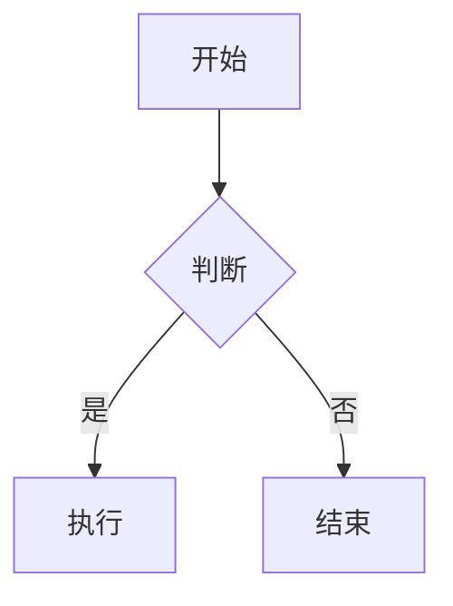

# Obsidian to WeChat HTML Skill

将 Obsidian Flavored Markdown 转换为微信公众号兼容的富文本 HTML。

## 核心功能

### Phase 1: 格式转换
1. **Admonition 代码块转换** - 识别 `ad-*` 语法
2. **标准 Callout 转换** - 识别 `> [!type]` 语法
3. **Mermaid 图表渲染** - 转换为图片
4. **代码块格式化** - 带行号和语法高亮
5. **链接转脚注** - 微信不支持超链接
6. **图片处理** - 居中显示和尺寸优化

### Phase 2: 一键发布
7. **获取 access_token** - 自动管理令牌缓存
8. **上传图片** - 本地图片自动上传到微信 CDN
9. **创建草稿** - 调用 API 发布到公众号草稿箱

## 转换规则

### 1. Admonition 代码块 (`ad-*`)

Admonition 插件使用代码块语法：

**输入格式：**
````markdown
```ad-question
title: 这是标题
这是内容
可以有多行
```
````

**输出 HTML：**
```html
<section class="note-callout note-callout-question">
  <section class="note-callout-title-wrap">
    <svg><!-- 对应图标 --></svg>
    <span class="note-callout-title">这是标题</span>
  </section>
  <section class="note-callout-content">
    <p>这是内容</p>
    <p>可以有多行</p>
  </section>
</section>
```

**解析规则：**
1. 匹配 ` ```ad-{type} ` 开始的代码块
2. 提取 `title:` 行作为标题（可选，默认使用类型名首字母大写）
3. 剩余内容作为正文
4. 根据类型查找 `references/admonition-mapping.md` 获取图标和样式类

### 2. 标准 Obsidian Callout

**输入格式：**
```markdown
> [!tip] 提示标题
> 这是提示内容
> 可以多行
```

**输出 HTML：** 同 Admonition，使用相同的 HTML 结构和样式类。

### 3. Mermaid 图表

**输入格式：**
````markdown

````

**转换策略：** 参考 `references/mermaid-handling.md`

**推荐输出（使用 mermaid.ink）：**
```html
<section class="mermaid-diagram" style="text-align: center; margin: 20px 0;">
  
</section>
```

### 4. 代码块（带行号）

**输入格式：**
````markdown
```python
def hello():
    print("Hello, World!")
```
````

**输出 HTML：**
```html
<section style="margin: 20px 0; border-radius: 8px; overflow: hidden; box-shadow: 0 2px 8px rgba(0,0,0,0.1);">
  <section style="background: #21252b; padding: 8px 16px;">
    <span style="color: #9da5b4; font-size: 12px; text-transform: uppercase; letter-spacing: 1px;">Python</span>
  </section>
  <pre style="margin: 0; background: #282c34; padding: 16px; overflow-x: auto;"><code style="font-family: Consolas, 'SF Mono', monospace; font-size: 14px; line-height: 1.6; color: #abb2bf;"><div><span style="display: inline-block; width: 32px; color: #636d83; text-align: right; margin-right: 16px;">1</span>def hello():</div>
<div><span style="display: inline-block; width: 32px; color: #636d83; text-align: right; margin-right: 16px;">2</span>    print("Hello, World!")</div></code></pre>
</section>
```

### 5. 链接转脚注

微信公众号不支持可点击的超链接，需要转换为脚注格式。

**输入：**
```markdown
查看 [官方文档](https://example.com) 了解更多。
```

**输出：**
```html
<p>查看 <span class="footnote-word">官方文档</span><sup class="footnote-ref">[1]</sup> 了解更多。</p>
<!-- 文末添加 -->
<section class="footnotes">
  <p class="footnote-item"><span class="footnote-num">[1]</span> 官方文档: https://example.com</p>
</section>
```

### 6. 图片处理

**输入：**
```markdown
![[image.png]]

```

**输出：**
```html
<section class="image-wrapper" style="text-align: center; margin: 20px 0;">
  
  <p class="image-caption" style="color: #888; font-size: 14px; margin-top: 8px;">描述</p>
</section>
```

### 7. 其他元素转换

| Markdown | HTML |
|----------|------|
| `# 标题` | `<h1>标题</h1>` |
| `**加粗**` | `<strong>加粗</strong>` |
| `*斜体*` | `<em>斜体</em>` |
| `==高亮==` | `<span class="highlight">高亮</span>` |
| `` `代码` `` | `<code>代码</code>` |
| `~~删除~~` | `<del>删除</del>` |
| `- 列表` | `<ul><li>列表</li></ul>` |
| `> 引用` | `<blockquote>引用</blockquote>` |

## 完整 HTML 包装

转换后的内容需要包装在完整的 HTML 结构中：

```html
<section id="nice">
  <!-- 样式内联到 style 属性或使用 <style> 标签 -->
  <style>
    /* 参考 references/wechat-css-styles.md */
  </style>

  <!-- 转换后的内容 -->
  {converted_content}

  <!-- 脚注区域（如有链接） -->
  <section class="footnotes">
    <hr style="border: none; border-top: 1px solid #eee; margin: 30px 0 20px;" />
    <p style="font-size: 14px; color: #888; margin-bottom: 10px;">参考链接：</p>
    {footnotes}
  </section>
</section>
```

## 工作流程

1. **读取源文件** - 使用 Read 工具读取 Obsidian markdown 文件
2. **预处理** - 提取 frontmatter、收集链接
3. **分块处理** - 识别并转换各类特殊语法块
4. **标准转换** - 转换普通 markdown 语法
5. **后处理** - 添加脚注、包装 HTML 结构
6. **输出** - 写入 HTML 文件或直接显示

## 使用示例

**用户请求：**
> 把这篇文章转换成微信公众号格式

**Claude 响应流程：**
1. 读取指定的 markdown 文件
2. 按照本 skill 规则转换
3. 应用 `references/wechat-css-styles.md` 中的样式
4. 输出完整 HTML 代码

## 参考资源

- `references/admonition-mapping.md` - Admonition 类型映射和 SVG 图标
- `references/wechat-css-styles.md` - 完整 CSS 样式表
- `references/mermaid-handling.md` - Mermaid 处理策略
- `references/wechat-api.md` - 微信 API 调用指南
- `config/wechat-credentials.local.md` - 凭证配置（用户本地文件）

## 注意事项

1. 微信公众号编辑器会过滤某些 CSS 属性，尽量使用内联样式
2. 图片需要已上传到可访问的服务器
3. 代码块不支持真正的语法高亮，使用背景色区分即可
4. 表格宽度可能需要调整以适应移动端
5. 避免使用 JavaScript，微信会过滤

---

## 一键发布到草稿箱

### 前置配置

1. 编辑 `config/wechat-credentials.local.md`，填入 appid 和 secret
2. 在公众号后台配置 IP 白名单（添加本机公网 IP）
3. （可选）上传默认封面图并配置 default_thumb_media_id

### Frontmatter 字段

文章可通过 frontmatter 指定发布元数据：

```yaml
---
title: "文章标题"           # 必填，不填则使用文件名
author: "作者名"            # 可选，使用默认作者
thumb_media_id: "xxx"       # 封面图素材ID（优先级最高）
banner: "https://..."       # 网络封面图URL
banner_path: "local.jpg"    # 本地封面图路径
digest: "文章摘要"          # 可选，不填自动截取
source_url: "原文链接"      # 可选，"阅读原文"链接
open_comment: 0             # 0-关闭评论，1-开启
---
```

### 封面图优先级

1. `thumb_media_id` - 直接使用已上传的素材 ID
2. `banner` - 网络图片 URL，需先下载再上传
3. `banner_path` - 本地图片路径，直接上传
4. `default_thumb_media_id` - 凭证配置中的默认封面

### 发布流程

```
┌─────────────────┐
│  读取 MD 文件   │
└────────┬────────┘
         ▼
┌─────────────────┐
│ 解析 frontmatter│
└────────┬────────┘
         ▼
┌─────────────────┐
│ 读取凭证配置    │ ◄── config/wechat-credentials.local.md
└────────┬────────┘
         ▼
┌─────────────────┐
│ 获取 access_token│ ◄── 检查是否过期（7200秒）
└────────┬────────┘
         ▼
┌─────────────────┐
│ 上传文章内图片  │ ◄── 替换为微信 CDN URL
└────────┬────────┘
         ▼
┌─────────────────┐
│ 处理封面图      │ ◄── 获取 thumb_media_id
└────────┬────────┘
         ▼
┌─────────────────┐
│ 转换 MD → HTML  │ ◄── 应用样式、Admonition、Mermaid
└────────┬────────┘
         ▼
┌─────────────────┐
│ 调用 draft/add  │
└────────┬────────┘
         ▼
┌─────────────────┐
│ 返回 media_id   │
└─────────────────┘
```

### 发布命令示例

本 Skill 已集成自动发布脚本 `publish_to_wechat.py`，无需手动执行复杂的 API 调用。

**使用方法：**

```bash
# 使用内置的便捷脚本（自动处理虚拟环境依赖）
./publish.sh <Markdown文件路径>
```

或者手动运行：

```bash
# 确保已安装依赖: requests pyyaml markdown
python3 publish_to_wechat.py <Markdown文件路径>
```

**脚本执行逻辑：**
1. 自动加载 `config/wechat-credentials.local.md` 中的配置
2. 自动检查并刷新 Access Token
3. 扫描 Markdown 内容，上传本地/网络图片到微信服务器
4. 替换图片链接为微信 CDN URL
5. 转换 Markdown 为带有内联样式的 HTML（支持 Admonition、代码高亮）
6. 调用微信 API 创建草稿

### 使用示例

**用户请求：**
> 把这篇文章发布到微信公众号草稿箱

**Claude 响应流程：**
1. 确认目标 Markdown 文件路径
2. 执行发布命令：`./publish.sh path/to/article.md`
3. 脚本输出执行日志（Token刷新、图片上传进度等）
4. 返回最终结果：发布成功通知及 Media ID

### 错误处理

| 错误 | 原因 | 解决方案 |
|------|------|----------|
| 40164 | IP 不在白名单 | 添加公网 IP 到白名单 |
| 40001 | token 无效 | 重新获取 access_token |
| 45009 | 调用超限 | 等待后重试 |
| 缺少封面图 | 未配置 thumb_media_id | 上传封面或配置默认封面 |

### 安全注意事项

1. `wechat-credentials.local.md` 包含敏感凭证，已加入 `.gitignore`
2. access_token 缓存在本地，有效期 7200 秒
3. 建议定期更换 AppSecret
