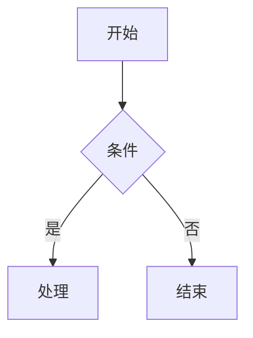
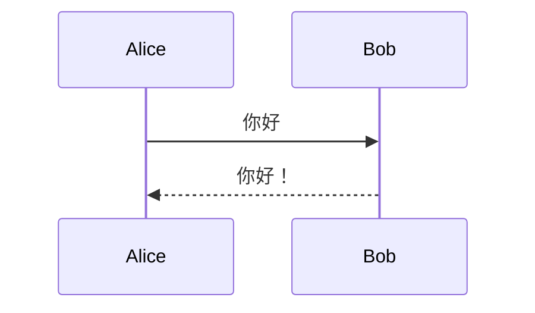
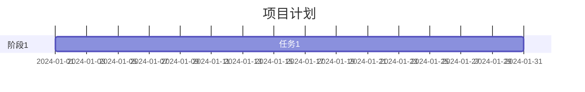
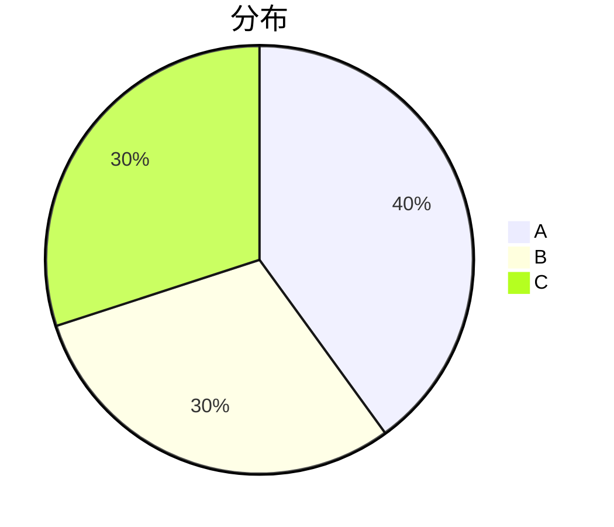

# Mermaid 图表处理策略

本文档描述如何将 Obsidian 中的 Mermaid 图表转换为微信公众号可显示的格式。

## 问题背景

微信公众号不支持 JavaScript，因此无法直接渲染 Mermaid 图表。需要将图表转换为静态图片。

---

## ✨ 当前实现方案（已集成）

### 三层降级策略（推荐）

本项目已实现自动降级渲染系统，确保在各种环境下都能正常处理 Mermaid 图表：

**第一层: Playwright 本地渲染** ⭐ 优先使用
- 完全本地化，不依赖外部服务
- 渲染质量最高，符合官方标准
- 需要安装: `pip install playwright && playwright install chromium`

**第二层: Kroki.io API** 🔄 备用方案
- 比 mermaid.ink 更稳定（官方维护）
- 无需本地依赖，即时可用
- 需要网络连接

**第三层: 优雅降级** 🛡️ 兜底保障
- 显示格式化的代码块
- 保证内容不丢失
- 无需任何依赖

### 快速开始

```bash
# 安装依赖（推荐，启用最佳渲染方案）
source .venv/bin/activate
pip install playwright
playwright install chromium

# 发布文章（自动处理 Mermaid）
.venv/bin/python publish_to_wechat.py your_article.md
```

**如果不安装 Playwright**: 系统会自动使用 Kroki.io 或降级显示，无需额外配置。

详细文档: 参见 `MERMAID_SOLUTION.md`

---

## 历史方案参考

### 方案 1: mermaid.ink API（已弃用）

### 优点
- 无需安装任何工具
- 即时可用
- 支持所有 Mermaid 图表类型

### 使用方法

1. **Base64 编码图表定义**

```javascript
const diagram = `graph TD
    A[开始] --> B{判断}
    B -->|是| C[执行]
    B -->|否| D[结束]`;

const base64 = btoa(unescape(encodeURIComponent(diagram)));
const url = `https://mermaid.ink/img/${base64}`;
```

2. **生成 HTML**

```html
<section class="mermaid-diagram" style="text-align: center; margin: 24px 0; padding: 16px; background: #fafafa; border-radius: 8px;">
  
</section>
```

### 支持的参数

| 参数 | 说明 | 示例 |
|------|------|------|
| `/img/` | PNG 格式（默认） | `mermaid.ink/img/{base64}` |
| `/svg/` | SVG 格式 | `mermaid.ink/svg/{base64}` |
| `?type=png` | 指定格式 | `mermaid.ink/img/{base64}?type=png` |
| `?bgColor=white` | 背景色 | `mermaid.ink/img/{base64}?bgColor=white` |
| `?theme=dark` | 主题 | `mermaid.ink/img/{base64}?theme=dark` |

### 编码示例

**Python:**
```python
import base64
import urllib.parse

diagram = """graph TD
    A[开始] --> B{判断}
    B -->|是| C[执行]"""

encoded = base64.b64encode(diagram.encode('utf-8')).decode('utf-8')
url = f"https://mermaid.ink/img/{encoded}"
```

**JavaScript:**
```javascript
const diagram = `graph TD
    A[开始] --> B{判断}`;

const encoded = btoa(unescape(encodeURIComponent(diagram)));
const url = `https://mermaid.ink/img/${encoded}`;
```

## 备选方案：mermaid-cli 本地渲染

### 安装
```bash
npm install -g @mermaid-js/mermaid-cli
```

### 使用
```bash
# 从文件渲染
mmdc -i diagram.mmd -o diagram.png

# 指定输出格式
mmdc -i diagram.mmd -o diagram.svg -f svg

# 指定主题
mmdc -i diagram.mmd -o diagram.png -t dark
```

### 优点
- 离线可用
- 更稳定
- 可自定义配置

### 缺点
- 需要 Node.js 环境
- 需要安装依赖

## 图表类型处理

### 流程图 (flowchart/graph)


### 时序图 (sequenceDiagram)


### 甘特图 (gantt)


### 饼图 (pie)


## 错误处理

### 常见问题

1. **图表语法错误**
   - 检查 Mermaid 语法
   - 使用 [Mermaid Live Editor](https://mermaid.live) 验证

2. **编码问题**
   - 确保使用 UTF-8 编码
   - 特殊字符需要正确转义

3. **图片加载失败**
   - 检查网络连接
   - 尝试使用备选 API

### 降级策略

如果 mermaid.ink 不可用：

```html
<!-- 显示代码块作为降级 -->
<section class="mermaid-fallback" style="background: #f5f5f5; padding: 16px; border-radius: 8px; margin: 20px 0;">
  <p style="color: #666; font-size: 14px; margin-bottom: 8px;">📊 图表（请在支持的环境查看）</p>
  <pre style="background: #fff; padding: 12px; border-radius: 4px; overflow-x: auto;"><code style="font-family: monospace; font-size: 13px;">graph TD
    A[开始] --> B{判断}</code></pre>
</section>
```

## 完整转换流程

1. **识别 Mermaid 代码块**
   ```regex
   ```mermaid\n([\s\S]*?)```
   ```

2. **提取图表定义**
   - 去除首尾空白
   - 保留换行符

3. **Base64 编码**
   - 使用 UTF-8 编码
   - 生成 URL 安全的 base64

4. **生成 HTML**
   - 使用 mermaid.ink URL
   - 添加适当的样式包装

5. **插入文档**
   - 替换原代码块位置
   - 保持文档结构

## 图表样式建议

- 使用浅色背景 (`bgColor=white`)
- 图表宽度不超过 600px
- 添加适当的边距
- 考虑移动端显示
