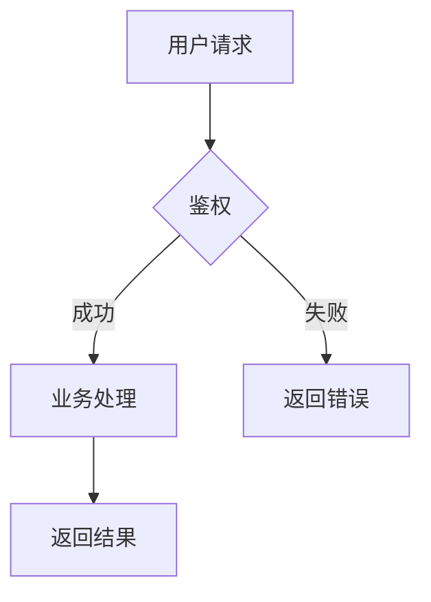
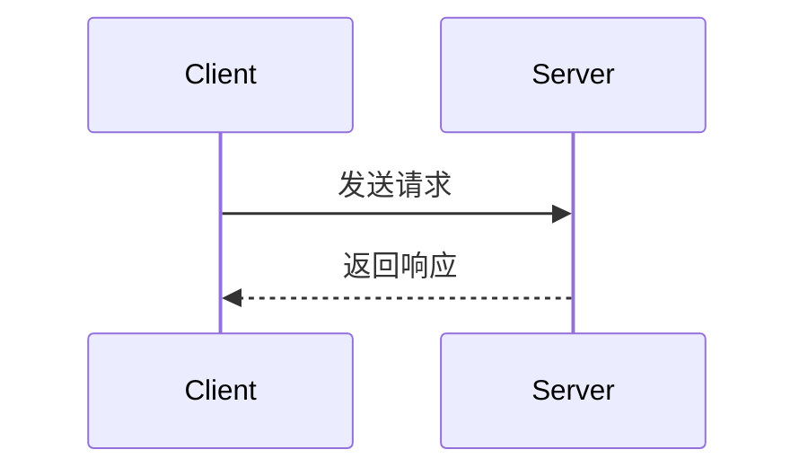

# Mermaid 渲染解决方案

## 问题描述

之前使用 mermaid.ink API 渲染 Mermaid 图表时，遇到了服务不稳定的问题（404/503 错误），导致草稿中的流程图无法正常显示。

## 解决方案架构

现已实现**三层降级策略**，确保在各种环境下都能优雅处理 Mermaid 图表：

```
┌─────────────────────────────────────────┐
│  第一层: Playwright 本地浏览器渲染     │  ← 优先使用（最稳定）
│  - 完全本地化，不依赖外部服务          │
│  - 渲染质量高，符合官方标准            │
│  - 需要安装 playwright 包              │
└─────────────────┬───────────────────────┘
                  │ 失败 ↓
┌─────────────────────────────────────────┐
│  第二层: Kroki.io API 远程渲染         │  ← 备用方案
│  - 比 mermaid.ink 更稳定               │
│  - 无需本地依赖                        │
│  - 需要网络连接                        │
└─────────────────┬───────────────────────┘
                  │ 失败 ↓
┌─────────────────────────────────────────┐
│  第三层: 优雅降级为格式化代码块        │  ← 兜底方案
│  - 显示原始 Mermaid 代码               │
│  - 带有友好的样式和提示                │
│  - 保证内容不丢失                      │
└─────────────────────────────────────────┘
```

## 技术实现

### 核心函数

#### 1. `render_mermaid_with_playwright(mermaid_code)`

使用 Playwright 在无头浏览器中渲染 Mermaid 图表。

**工作流程**:
1. 创建临时 HTML 文件，加载 mermaid.js CDN
2. 使用 Playwright 启动 Chromium 无头浏览器
3. 等待图表渲染完成（2秒）
4. 截取 SVG 元素的截图
5. 返回 PNG 图片路径

**优点**:
- ✅ 完全本地化，不受外部服务影响
- ✅ 渲染质量高
- ✅ 支持所有 Mermaid 图表类型

**要求**:
```bash
pip install playwright
playwright install chromium
```

#### 2. `render_mermaid_with_kroki(mermaid_code)`

使用 Kroki.io API 远程渲染。

**编码方式**:
```python
compressed = zlib.compress(mermaid_code.encode('utf-8'), level=9)
encoded = base64.urlsafe_b64encode(compressed).decode('utf-8')
url = f"https://kroki.io/mermaid/png/{encoded}"
```

**优点**:
- ✅ 无需本地依赖
- ✅ 比 mermaid.ink 更稳定
- ✅ 官方维护

#### 3. `render_mermaid_locally(mermaid_code)`

协调三层降级策略的主控函数。

**降级逻辑**:
```python
# 尝试第一层
result = render_mermaid_with_playwright(code)
if result: return result

# 尝试第二层
result = render_mermaid_with_kroki(code)
if result: return result

# 第三层降级
return None  # 触发代码块显示
```

### 降级代码块样式

当所有渲染方案失败时，会生成如下 HTML：

```html
<section class="mermaid-fallback" style="...">
  <p>📊 流程图 (Mermaid)</p>
  <pre><code>{原始代码}</code></pre>
  <p>提示: 图表渲染暂时不可用，已显示原始代码</p>
</section>
```

## 安装与配置

### 1. 安装依赖（推荐）

```bash
# 进入项目目录
cd obsidian-wechat

# 激活虚拟环境
source .venv/bin/activate  # macOS/Linux
# 或
.venv\\Scripts\\activate    # Windows

# 安装 Playwright
pip install playwright

# 下载 Chromium 浏览器
playwright install chromium
```

### 2. 仅使用备用方案（无需额外依赖）

如果不安装 Playwright，系统会自动跳转到 Kroki.io API，无需额外配置。

## 测试验证

### 运行测试脚本

```bash
.venv/bin/python test_mermaid.py
```

### 预期输出

```
============================================================
Mermaid 渲染测试
============================================================

处理 Mermaid 图表...
  [1/3] 尝试使用 Playwright 本地渲染...
  ✓ Playwright 渲染成功

处理 Mermaid 图表...
  [1/3] 尝试使用 Playwright 本地渲染...
  ✓ Playwright 渲染成功

✅ 测试通过: Mermaid 代码块已被处理
```

## 使用示例

### Markdown 文件示例

```markdown
---
title: "技术方案"
---

# 系统架构



## 时序图


\```

### 发布到微信

```bash
# 使用发布脚本
.venv/bin/python publish_to_wechat.py your_article.md

# 或使用便捷脚本
./publish.sh your_article.md
```

## 性能对比

| 方案 | 平均耗时 | 稳定性 | 依赖 |
|------|---------|--------|------|
| Playwright | ~3秒 | ⭐⭐⭐⭐⭐ | playwright |
| Kroki.io | ~1秒 | ⭐⭐⭐⭐ | 网络 |
| 降级显示 | <0.1秒 | ⭐⭐⭐⭐⭐ | 无 |

## 故障排查

### 问题 1: Playwright 安装失败

**症状**: `ModuleNotFoundError: No module named 'playwright'`

**解决**:
```bash
pip install playwright
playwright install chromium
```

### 问题 2: Kroki.io 超时

**症状**: `Kroki.io 渲染失败: timeout`

**解决**:
- 检查网络连接
- 系统会自动降级为代码块显示

### 问题 3: 所有方案都失败

**症状**: 图表显示为代码块

**说明**: 这是正常的降级行为，确保内容不丢失。可以：
1. 检查网络连接后重试
2. 手动安装 Playwright
3. 接受代码块显示（内容完整保留）

## 技术细节

### Kroki.io 编码算法

Kroki 使用 deflate 压缩 + Base64 URL-safe 编码：

```python
import zlib
import base64

# 压缩
compressed = zlib.compress(diagram_code.encode('utf-8'), level=9)

# 编码
encoded = base64.urlsafe_b64encode(compressed).decode('utf-8')

# 生成 URL
url = f"https://kroki.io/mermaid/png/{encoded}"
```

### Playwright 渲染优化

- 使用无头模式（headless=True）节省资源
- 设置合理的视口大小（800x600）
- 等待时间优化为 2 秒（足够渲染完成）
- 仅截取 SVG 元素，避免多余空白

## 更新日志

### 2026-01-24

- ✅ 实现 Playwright 本地渲染
- ✅ 添加 Kroki.io 备用方案
- ✅ 完善降级代码块样式
- ✅ 添加完整测试脚本
- ✅ 更新文档

## 参考资源

- [Playwright 官方文档](https://playwright.dev/python/)
- [Kroki.io 官方文档](https://kroki.io/)
- [Mermaid 语法参考](https://mermaid.js.org/)
- [项目 GitHub](https://github.com/anthropics/claude-code)

---

**维护者**: Chaucer
**最后更新**: 2026-01-24
